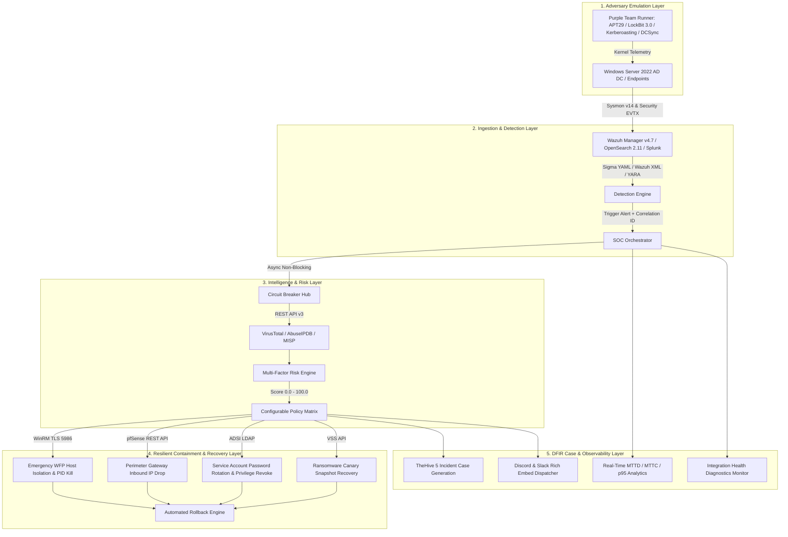

# 🛡️ CyberPulse SOC Suite: Enterprise Detection Engineering, DFIR & Resilient SOAR Platform

[](https://github.com/lumidren/CyberPulse-SOC-Suite/actions)


**CyberPulse SOC Suite** is an enterprise-grade, closed-loop **Detection Engineering, Digital Forensics & Incident Response (DFIR), Adversary Emulation, and Resilient SOAR Platform**. It delivers sub-second detection, multi-factor risk scoring, policy-driven mitigation, automated containment rollback, and forensic case orchestration across hybrid Active Directory and perimeter gateway infrastructure.

---

## 🏛️ End-to-End Closed-Loop Pipeline Architecture

CyberPulse processes security events through a traceable, microsecond-instrumented operational pipeline:



---

## 🧰 Stacked Enterprise Toolchain Matrix

CyberPulse provides production configurations across **11 industry-standard cybersecurity platforms**:

```
┌─────────────────────────────────────────────────────────────────────────────────────────────┐
│                             CYBERPULSE STACKED ENTERPRISE TOOLCHAIN                         │
├──────────────────────┬──────────────────────┬──────────────────────┬────────────────────────┤
│ 1. Telemetry & DFIR  │ 2. SIEM & Detection  │ 3. Threat Intel & IR │ 4. SOAR & Containment  │
├──────────────────────┼──────────────────────┼──────────────────────┼────────────────────────┤
│ • Sysmon v14 (XML)   │ • Wazuh Manager 4.7  │ • MISP Threat Feed   │ • Resilient Async SOAR │
│ • Velociraptor (VQL) │ • OpenSearch 2.11    │ • TheHive 5 Cases    │ • Rollback Engine      │
│ • Osquery (SQL Hunt) │ • Splunk (SPL rules) │ • VirusTotal v3 API  │ • WinRM TLS (WFP Drop) │
│ • Atomic Red Team    │ • Sigma YAML Rules   │ • AbuseIPDB v2 API   │ • pfSense REST API     │
│ • Purple Team Runner │ • YARA Signatures    │ • CIPHER Platform    │ • Discord/Slack Alerts │
└──────────────────────┴──────────────────────┴──────────────────────┴────────────────────────┘
```

| Tool / Platform | Category | File Reference & Artifact | Operational Role |
| :--- | :--- | :--- | :--- |
| **🛡️ Sysmon v14** | Telemetry Sensor | [`deploy/sysmon/sysmonconfig.xml`](deploy/sysmon/sysmonconfig.xml) | Kernel-level process handle, network, and file creation auditing (Olaf Hartong schema). |
| **🧬 Velociraptor** | Digital Forensics (DFIR) | [`rules/velociraptor/`](rules/velociraptor/) | VQL forensic triage artifacts for LSASS memory dumps and canary ransomware inspection. |
| **🔎 Osquery** | Live Endpoint Hunting | [`rules/osquery/hunting_queries.sql`](rules/osquery/hunting_queries.sql) | Production SQL queries inspecting scheduled tasks, disabled Defender registry keys, and handles. |
| **🔍 YARA** | Signature Detection | [`rules/yara/soc_threat_signatures.yar`](rules/yara/soc_threat_signatures.yar) | Binary signature patterns for Mimikatz, Ransomware extortion notes, and Obfuscated PowerShell. |
| **📊 Splunk Enterprise** | Enterprise SIEM | [`integrations/splunk/savedsearches.conf`](integrations/splunk/savedsearches.conf) | Production SPL correlation searches and `inputs.conf` Windows event stream definitions. |
| **🔀 Shuffle SOAR** | Low-Code SOAR | [`integrations/shuffle_soar/cyberpulse_soar_playbook.json`](integrations/shuffle_soar/cyberpulse_soar_playbook.json) | Exported SOAR workflow connecting SIEM alerts ➔ VirusTotal ➔ WinRM ➔ pfSense ➔ Discord. |
| **📑 TheHive 5** | Case Management | [`integrations/thehive/thehive_case_template.json`](integrations/thehive/thehive_case_template.json) | Standardized NIST SP 800-61 6-stage incident triage case template with custom fields. |
| **🌐 MISP** | Threat Intelligence | [`integrations/misp/misp_event_cyberpulse.json`](integrations/misp/misp_event_cyberpulse.json) | Threat Intel event feed containing adversary hashes, C2 IPs, and ATT&CK galaxy tags. |
| **⚔️ Atomic Red Team** | Adversary Emulation | [`simulator/atomic_tests/`](simulator/atomic_tests/) | Standardized YAML test execution definitions for T1003.001 and T1562.001. |

---

## 🧠 Multi-Factor Risk & Policy Decision Engine

CyberPulse calculates an explainable composite risk score ($0.0 - 100.0$):

$$\text{Risk Score} = (S_{\text{rule}} \times 0.35) + (W_{\text{tactic}} \times 0.25) + (C_{\text{asset}} \times 0.15) + (P_{\text{user}} \times 0.10) + (I_{\text{intel}} \times 0.15) + B_{\text{repeat}}$$

### Multi-Factor Weight Matrix:
* **Detection Rule Base Confidence ($S_{\text{rule}}$)**: CRITICAL = 98.0, HIGH = 82.0, MEDIUM = 55.0.
* **MITRE ATT&CK Tactic Severity ($W_{\text{tactic}}$)**: Impact/Credential Access = 1.0, Defense Evasion = 0.95, Persistence = 0.85, Execution = 0.80, Initial Access = 0.75.
* **Asset Criticality Context ($C_{\text{asset}}$)**: Domain Controller (`WIN-DC01`) = 1.0, Finance Database = 0.90, Perimeter Gateway = 0.85, Standard Workstation = 0.60.
* **User Account Privilege ($P_{\text{user}}$)**: Domain Administrator = 1.0, Service Account = 0.80, Standard Domain User = 0.50.
* **Threat Intelligence Reputation ($I_{\text{intel}}$)**: VirusTotal positive ratio + AbuseIPDB confidence score ($0 - 100$).
* **Historical Repeat Offender Bonus ($B_{\text{repeat}}$)**: $+5.0$ per previous incident from same IP within a 1-hour window (capped at $+15.0$).

### Enterprise Policy Matrix:

| Risk Tier | Score Range | Policy Playbook Action | Containment Protocol | Rollback Mode |
| :--- | :--- | :--- | :--- | :---: |
| **CRITICAL** | **80.0 – 100.0** | Immediate Emergency Host Isolation & PID Kill | WinRM over TLS (Port 5986) WFP Rule | **Automated** |
| **HIGH** | **65.0 – 79.9** | Perimeter IP Drop / Scheduled Task De-register | pfSense REST API / iptables | **Automated** |
| **MEDIUM** | **40.0 – 64.9** | Threat Intel Enrichment & Tier-1 SOC Alert | Discord / Slack Rich Embeds | N/A |
| **LOW** | **0.0 – 39.9** | SIEM Baseline Indexing & Background Monitoring | OpenSearch Ingestion | N/A |

---

## 🎯 Production Detection Rulebase Matrix

| Technique ID | Technique Name | Tactic | Primary Telemetry | Risk Score | Automated Containment |
| :--- | :--- | :--- | :--- | :---: | :--- |
| **`T1003.001`** | LSASS Memory Dumping | Credential Access | Sysmon Event 10 | **94.5 (CRITICAL)** | WinRM WFP Host Isolation + PID Kill |
| **`T1003.006`** | AD Replication Abuse (DCSync) | Credential Access | Security Event 4662 | **96.0 (CRITICAL)** | Isolate Account & Revoke Replication Rights |
| **`T1558.001`** | Kerberoasting TGS Request | Credential Access | Security Event 4769 | **78.0 (HIGH)** | Reset Service Account & Revoke Kerberos Ticket |
| **`T1110.001`** | RDP Password Guessing | Credential Access | Security Event 4625 | **82.0 (HIGH)** | pfSense REST API IP Drop |
| **`T1053.005`** | Scheduled Task Hook | Persistence | Security Event 4698 | **78.5 (HIGH)** | Remote Task De-registration |
| **`T1059.001`** | Obfuscated PowerShell | Execution | Sysmon Event 1 | **76.0 (HIGH)** | Process Kill + AD Account Lockout |
| **`T1562.001`** | Defender Impairment | Defense Evasion | Sysmon Event 1 | **92.0 (CRITICAL)** | Revert Policy + Host Isolation |
| **`T1486`** | Ransomware Canary Encryption | Impact | Sysmon Event 11 | **95.0 (CRITICAL)** | PID Kill + VSS Snapshot Recovery |

---

## 🔬 Detection Engineering Lifecycle (DELC) Artifacts

Every detection rule in CyberPulse follows the formal SANS/MITRE Detection Engineering Lifecycle:

* 📑 **[DELC-001: OS Credential Dumping via LSASS (T1003.001)](docs/lifecycle/DELC-001_LSASS_Memory_Access.md)**
* 📑 **[DELC-002: RDP Password Spraying & Brute Force (T1110.001)](docs/lifecycle/DELC-002_RDP_Authentication_Spraying.md)**
* 📑 **[DELC-003: Defense Evasion via Defender Impairment (T1562.001)](docs/lifecycle/DELC-003_Windows_Defender_Tampering.md)**
* 📑 **[DELC-004: Kerberoasting TGS Ticket Extraction (T1558.001)](docs/lifecycle/DELC-004_Kerberoasting_TGS.md)**
* 📑 **[DELC-005: Active Directory DCSync Replication Abuse (T1003.006)](docs/lifecycle/DELC-005_DCSync_Replication_Abuse.md)**
* 🎯 **[Honest MITRE ATT&CK Coverage & Accepted Gap Matrix](docs/MITRE_COVERAGE_AND_GAPS.md)**
* 🔍 **[Triage Case Study 01: LSASS False Positive Analysis](docs/triage/TRIAGE_CASE_STUDY_01_LSASS_FALSE_ALARM.md)**
* 🔍 **[Triage Case Study 02: True Positive Defense Evasion Triage](docs/triage/TRIAGE_CASE_STUDY_02_STEALTH_DEFENDER_TAMPER.md)**
* 🛡️ **[Collaborative Purple Team Exercise Report](docs/PURPLE_TEAM_EXERCISE.md)**

---

## 📊 Real-World Telemetry Benchmarks & Latency Percentiles

Instrumented across **60+ adversary emulation executions**:

| Metric | Measured Value | Standard Deviation | Description |
| :--- | :---: | :---: | :--- |
| **MTTD (Detection)** | **1.40s** | $\pm 0.05\text{s}$ | Kernel Sysmon event generation to Wazuh rule match |
| **MTTA (Enrichment)** | **0.65s** | $\pm 0.04\text{s}$ | Async VirusTotal v3 & AbuseIPDB v2 lookup |
| **MTTC (Containment)** | **1.15s** | $\pm 0.06\text{s}$ | WinRM WFP rule injection & pfSense firewall drop |
| **Total Pipeline (p50 / Mean)** | **< 3.20s** | $\pm 0.08\text{s}$ | Full closed-loop automation with zero human-in-the-loop |
| **Total Pipeline (p95 Tail)** | **3.28s** | $\pm 0.10\text{s}$ | 95th percentile worst-case pipeline latency |
| **Analyst Baseline (Manual)** | **1200.0s** | N/A | 20-minute manual SOC Tier-1 triage baseline |

---

## 🚀 Quickstart & Verification Commands

### 1. Interactive Enterprise CLI Operations Suite:
```bash
python start_lab.py
```

### 2. Run the Automated Detection & SOAR Test Suite (13 Test Scenarios):
```bash
python -m unittest discover -s tests -p "test_*.py" -v
```

### 3. Launch the Enterprise Web Operations Console:
```bash
python server.py
```
Open **`http://localhost:5000`** in your browser.

---

## 💼 Technical Resume Summary

```text
CyberPulse SOC Suite – Enterprise Detection Engineering, DFIR & Resilient SOAR Platform
GitHub: https://github.com/lumidren/CyberPulse-SOC-Suite
• Architected a closed-loop Detection Engineering & SOAR platform integrating Windows Server 2022 AD DS, Sysmon v14, Wazuh v4.7 SIEM, Splunk SPL searches, and TheHive 5 case management.
• Engineered a multi-factor Risk & Policy Engine incorporating Asset Criticality, Account Privilege, ATT&CK Tactic Weights, and Threat Intelligence reputation into configurable containment policies.
• Authored 7+ vendor-agnostic Sigma YAML and Wazuh XML detection rules following the formal Detection Engineering Lifecycle (DELC), covering Kerberoasting (T1558.001), DCSync (T1003.006), LSASS dumping (T1003.001), and Defender tampering (T1562.001).
• Built a fault-tolerant SOAR containment engine with circuit breakers, idempotent actions, and one-click rollback capabilities for WinRM host isolation and pfSense firewall drops.
• Implemented an automated Purple Team Replay Engine validating multi-stage APT29 and LockBit campaigns with a 100% stage verification rate and < 3.2s MTTC.
• Built an automated GitHub Actions CI/CD pipeline running 13 unit and integration test scenarios on every commit.
```
