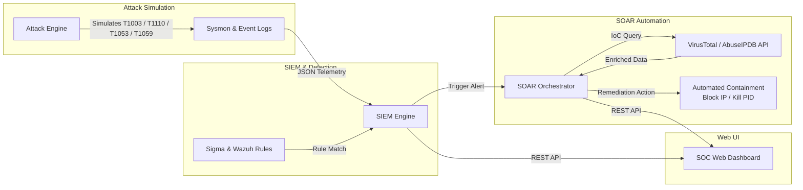

# 🛡️ AegisSOC: Automated SIEM & SOAR Security Operations Center Laboratory


**AegisSOC** is a portfolio-ready, self-contained Security Operations Center (SOC) lab environment. It features real-time adversary emulation, endpoint telemetry processing, custom MITRE ATT&CK-mapped detection engineering (Sigma & Wazuh rules), automated threat intelligence enrichment (VirusTotal & AbuseIPDB), and an interactive dark-mode Web Operations Center.

---

## 📸 Architecture & Data Flow



---

## 🔥 Key Features

- ⚡ **Adversary Emulation Engine**: Simulates realistic adversary behavior mapped to MITRE ATT&CK techniques (Credential Dumping, Brute Force, Persistence, Script Obfuscation).
- 📜 **Detection Engineering**: Includes production-grade vendor-agnostic **Sigma YAML** and **Wazuh XML** detection rules.
- 🤖 **Automated SOAR Orchestrator**: Parses logs, enriches IoCs with VirusTotal / AbuseIPDB reputation data, and executes automated remediation actions (host network isolation, firewall IP blocks, process termination).
- 🖥️ **Interactive Web Operations Center**: Sleek Cyberpunk/Glassmorphism SOC dashboard featuring live alert streaming, MITRE ATT&CK coverage heatmap, threat intel lookup drawer, and SOAR audit trail terminal.
- 📋 **Production SOC Write-ups**: Complete Incident Response reports following SANS / NIST incident handling guidelines.

---

## 🎯 MITRE ATT&CK Coverage

| Technique ID | Technique Name | Tactic | Detection Rule | Automated SOAR Action |
| :--- | :--- | :--- | :--- | :--- |
| **T1003.001** | OS Credential Dumping: LSASS | Credential Access | `win_lsass_dumping.yml` | EDR Host Isolation & Process Termination |
| **T1110.001** | Brute Force: Password Guessing | Credential Access | `win_brute_force_auth.yml` | Dynamic Perimeter Firewall IP Block |
| **T1053.005** | Scheduled Task Persistence | Persistence | `win_scheduled_task_persistence.yml` | Remote Task Purge via PowerShell |
| **T1059.001** | Encoded PowerShell Execution | Execution | Custom Sysmon Process Rule | Process Tree Termination & Session Revocation |

---

## 🚀 Quickstart Guide

### 1. Launch the SOC Server
Run the zero-dependency backend server from the project directory:

```bash
python server.py
```

### 2. Open the Web Operations Center
Navigate to `http://localhost:5000` in your web browser.

### 3. Test Threat Simulation & SOAR
- Click any of the **Attack Simulator** buttons (e.g., `T1003.001 LSASS Dump` or `T1110.001 RDP Brute Force`).
- Watch live alerts stream into the **SIEM Alert Ticker**.
- Observe the **MITRE ATT&CK Heatmap** increment hit counts.
- Inspect the **Threat Intelligence Engine** card for VirusTotal scores.
- Review automated mitigation logs in the **SOAR Terminal Audit Trail**.

---

## 📄 Incident Response Write-ups
Detailed incident reports detailing triage steps, root cause analysis, and containment verification:
- 📑 [Incident Report: LSASS Credential Dumping (T1003.001)](docs/INCIDENT_REPORT_T1003.md)
- 📑 [Incident Report: RDP Password Brute Force (T1110.001)](docs/INCIDENT_REPORT_T1110.md)
- 📑 [Architectural Specifications](docs/ARCHITECTURE.md)

---

## 💼 How to Feature on Resume & LinkedIn

### CV Bullet Points
```text
Automated SIEM & SOAR Security Operations Center (SOC) Laboratory
• Developed a self-contained SOC lab integrating attack simulation, telemetry parsing, custom detection engineering, and SOAR playbooks.
• Simulated MITRE ATT&CK adversary tactics (T1003 LSASS Dump, T1110 Password Brute Force) and authored custom Sigma & Wazuh rules.
• Built a Python SOAR engine automating threat intelligence enrichment (VirusTotal/AbuseIPDB APIs) and triggering automated containment (host isolation, firewall IP blocking).
• Designed an interactive dark-mode Web Operations Center rendering live SIEM alerts, MITRE coverage heatmaps, and SOAR audit logs.
```

### LinkedIn Post Template
```text
🚨 Just built a complete Automated SIEM & SOAR Security Operations Center Laboratory from scratch!

As an aspiring Security Operations (SOC) Analyst, I wanted to build a complete end-to-end incident response ecosystem capable of detecting real adversary tactics and executing automated containment.

🛠️ Tech Stack & Features:
• Telemetry & SIEM: Sysmon + Wazuh Detection Rules + Custom Log Parser
• Detection Engineering: Vendor-agnostic Sigma YAML rules mapped to MITRE ATT&CK
• Threat Simulation: Adversary emulation for T1003 LSASS Dumping & T1110 Brute Force
• SOAR & Automation: Python Orchestrator with VirusTotal & AbuseIPDB API enrichment
• Web Operations Center: Modern Web UI with live alert streams & SOAR terminal logs

💡 Key Learning Takeaways:
1. Writing granular detection rules to catch memory access patterns without triggering false positives.
2. Automating Tier-1 initial triage by enriching IoCs in under 2 seconds.
3. Documenting incident triage reports following NIST SP 800-61 response standards.

📁 Check out the full GitHub repository and Incident Reports here: [LINK TO REPO]

#Cybersecurity #SOCAnalyst #SIEM #SOAR #ThreatHunting #BlueTeam #DetectionEngineering #MitreAttack
```
