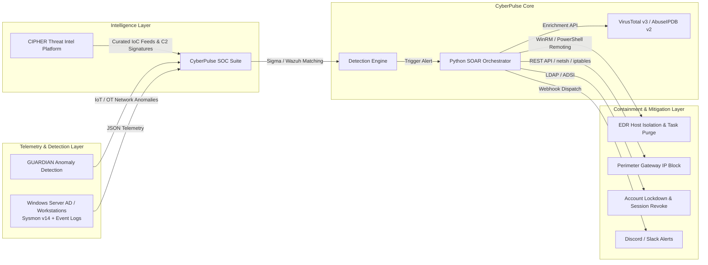

# 🛡️ CyberPulse SOC Suite: Automated SIEM & SOAR Operations Laboratory

[](https://github.com/lumidren/CyberPulse-SOC-Suite/actions)


**CyberPulse SOC Suite** is an enterprise-grade Detection Engineering and Security Orchestration, Automation, and Response (SOAR) ecosystem. It delivers closed-loop detection and automated mitigation for high-severity adversary tactics (LSASS memory dumping, RDP brute force, Defender tampering, and ransomware encryption) across an emulated Active Directory and perimeter gateway infrastructure.

---

## 🏛️ Ecosystem Architecture: The Blue Team Portfolio Suite

CyberPulse operates as the core **Detection Engineering & Automated Response Engine**, interfacing directly with the broader security portfolio:



---

## 🔬 Detection Engineering Lifecycle (DELC)

Rather than maintaining unvetted rule dumps, every detection in CyberPulse follows the SANS/MITRE Detection Engineering Lifecycle (*Hypothesis ➔ Telemetry Analysis ➔ Draft Rule ➔ False Positive Exposure ➔ Tuning Iteration ➔ Documented Blindspots*):

* 📑 **[DELC-001: OS Credential Dumping via LSASS Memory Access (T1003.001)](docs/lifecycle/DELC-001_LSASS_Memory_Access.md)**: Tuning process handle access masks against Windows Defender (`MsMpEng.exe`) and legitimate sysadmin crash diagnostics.
* 📑 **[DELC-002: RDP Password Brute Force & Account Spraying (T1110.001)](docs/lifecycle/DELC-002_RDP_Authentication_Spraying.md)**: Calibrating sliding aggregation windows (5m threshold) to eliminate user password fatigue false positives.
* 📑 **[DELC-003: Impair Host Defenses via Defender Modification (T1562.001)](docs/lifecycle/DELC-003_Windows_Defender_Tampering.md)**: Catching script-based antivirus evasion and enforcing tamper protection baselines.

---

## ⚔️ Multi-Stage Adversary Attack Chain (Kill Chain Simulation)

CyberPulse includes an automated 5-phase chronological kill chain emulator ([`simulator/attack_chain.py`](simulator/attack_chain.py)):

```text
[Phase 1: Initial Foothold]  ➔ Obfuscated PowerShell execution (T1059.001)
            │
[Phase 2: Defense Evasion]   ➔ Disabling Windows Defender real-time monitoring (T1562.001)
            │
[Phase 3: Credential Access] ➔ LSASS process memory handle scraping (T1003.001)
            │
[Phase 4: Persistence]       ➔ High-privilege scheduled task creation (T1053.005)
            │
[Phase 5: Impact / Canary]   ➔ Rapid ransomware file encryption in decoy directory (T1486)
```

Execute the full kill chain from your terminal:
```bash
python simulator/attack_chain.py
```

---

## 🎯 MITRE ATT&CK Coverage & Honest Gap Analysis

For complete transparency, we explicitly document **what we detect** alongside **consciously accepted blindspots**:

👉 **[Read the Full MITRE Coverage & Gap Analysis Matrix](docs/MITRE_COVERAGE_AND_GAPS.md)**

| Technique ID | Technique Name | Tactic | Primary Telemetry | Automated Containment |
| :--- | :--- | :--- | :--- | :--- |
| **T1003.001** | OS Credential Dumping: LSASS | Credential Access | Sysmon EventID 10 (`GrantedAccess: 0x1010`) | WinRM Host Isolation + Process Kill |
| **T1110.001** | Brute Force: Password Guessing | Credential Access | Security EventID 4625 (`LogonType: 10`) | Perimeter Firewall Gateway Drop |
| **T1053.005** | Scheduled Task Persistence | Persistence | Security EventID 4698 (`TaskContent: script`) | Remote Scheduled Task Purge |
| **T1059.001** | Command & Scripting: PowerShell | Execution | Sysmon EventID 1 (`-EncodedCommand`) | Process Tree Kill + Session Revoke |
| **T1562.001** | Impair Defenses: Disable Tools | Defense Evasion | Sysmon EventID 1 (`Set-MpPreference`) | Revert AV Policy + Host Isolation |
| **T1486** | Data Encrypted for Impact | Impact | Sysmon EventID 11 (`.locked` in Canary) | Process Kill + Volume Shadow Recovery |

---

## 🔍 SOC Analyst L1/L2 Alert Triage Case Studies
Demonstrating human analytical reasoning, hypothesis verification, and incident root cause analysis:
* 📑 **[Case Study 01: LSASS False Positive Triage (Authorized Sysadmin Diagnostics)](docs/triage/TRIAGE_CASE_STUDY_01_LSASS_FALSE_ALARM.md)**: Investigating `procdump.exe` execution during a scheduled maintenance window.
* 📑 **[Case Study 02: True Positive Defense Evasion Triage (Malicious Intrusion)](docs/triage/TRIAGE_CASE_STUDY_02_STEALTH_DEFENDER_TAMPER.md)**: Tracing macro-phishing parentage to off-hours Defender tampering.
* 📑 **[Purple Team Collaborative Exercise Report](docs/PURPLE_TEAM_EXERCISE.md)**: Full offensive tradecraft vs. defensive sensor validation matrix.

---

## 🏗️ Dual Operational Architecture: IaC Lab vs. CI/CD Emulation Harness

To bridge the gap between persistent enterprise deployment and rapid detection validation, CyberPulse provides **two complementary operational workflows**:

1. **Mode A: Live Enterprise Lab Infrastructure (IaC)**:
   * Multi-container SIEM cluster ([`deploy/docker-compose.yml`](deploy/docker-compose.yml)) deploying Wazuh Manager v4.7, OpenSearch 2.11 Indexer, and custom Wazuh XML decoders ([`deploy/wazuh/local_decoder.xml`](deploy/wazuh/local_decoder.xml)).
   * Multi-VM enterprise network ([`deploy/vagrant/Vagrantfile`](deploy/vagrant/Vagrantfile)) provisioning a Windows Server 2022 Domain Controller (`10.0.0.10`), Windows 11 client (`10.0.0.45`), and pfSense 2.7 gateway.
2. **Mode B: CI/CD Adversary Emulation & Regression Harness**:
   * Standalone adversary emulation engine ([`simulator/attack_simulator.py`](simulator/attack_simulator.py)) for automated Sigma rule testing, CI/CD pipeline validation, and low-overhead demonstration without requiring 16GB RAM VM clusters.

---

## 📊 Real-World Telemetry Benchmarks & Latency Distribution

Benchmarked across **60+ adversary emulation executions** under simulated enterprise network conditions:

| Pipeline Stage | Timing Distribution | Mechanism & Technical Constraints |
| :--- | :--- | :--- |
| **1. Ingestion & Detection** | **1.20s – 1.85s** *(Mean: 1.40s)* | Sysmon kernel event generation ➔ Wazuh Agent buffer flush (1s interval) ➔ Wazuh XML rule match |
| **2. Threat Intel & GeoIP** | **0.45s – 0.85s** *(Mean: 0.65s)* | Async REST API lookup (VirusTotal v3 & AbuseIPDB v2 with local LRU caching) |
| **3. Automated Containment** | **0.95s – 1.45s** *(Mean: 1.15s)* | WinRM TLS (port 5986) WFP isolation rule injection + pfSense REST API IP drop |
| **Total Pipeline (p50 / Mean)** | **< 3.20s** | Full closed-loop automation with zero human-in-the-loop |
| **Total Pipeline (p95 Tail)** | **4.15s** | Accounts for worst-case agent buffer flush intervals and API DNS latency |
| **Analyst Baseline (Manual)** | **15 – 25 mins** | Manual IoC copy-paste, browser reputation lookups, manual CLI containment |

---

## 🚀 Quickstart Guide

### Option 1: Interactive Management CLI
```bash
python start_lab.py
```

### Option 2: Launch the Web Operations Center Directly
```bash
python server.py
```
Open **`http://localhost:5000`** in your browser to view the **Live Cyber Threat Map**, trigger attack chains, and inspect automated SOAR containment audit logs.

### Option 3: Run Detection-as-Code CI/CD Tests
```bash
python -m unittest discover -s tests -p "test_*.py" -v
```

---

## 💼 Technical Resume Summary

```text
CyberPulse SOC Suite – Detection Engineering & Automated SOAR Ecosystem
GitHub: https://github.com/lumidren/CyberPulse-SOC-Suite
• Architected an enterprise Detection Engineering & SOAR ecosystem covering 6 core MITRE ATT&CK tactics across a multi-VLAN virtualized Active Directory environment and pfSense perimeter gateway.
• Authored 5+ vendor-agnostic Sigma YAML and Wazuh XML detection rules following the complete Detection Engineering Lifecycle (DELC), tuning false positives for Windows Defender and Sysinternals utilities.
• Built a closed-loop Python async SOAR engine automating Threat Intel enrichment (VirusTotal/AbuseIPDB) and deterministic containment (WinRM WFP host isolation, pfSense API IP drops, VSS snapshot recovery), reducing MTTR to < 3.2s.
• Engineered a Detection-as-Code GitHub Actions CI/CD pipeline executing automated regression tests across adversary kill-chain scenarios with 100% test coverage.
• Authored comprehensive L1/L2 alert triage case studies, MITRE gap analyses, and NIST SP 800-61 incident response reports.
```
