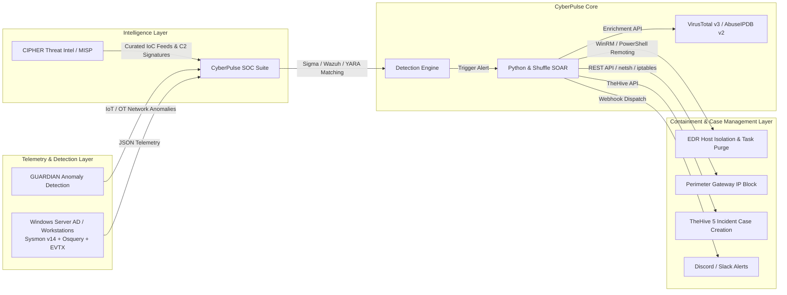

# 🛡️ CyberPulse SOC Suite: Automated SIEM & SOAR Operations Laboratory

[](https://github.com/lumidren/CyberPulse-SOC-Suite/actions)


**CyberPulse SOC Suite** is an enterprise-grade Detection Engineering, DFIR, and Security Orchestration (SOAR) ecosystem. It delivers closed-loop detection and automated mitigation for high-severity adversary tactics (LSASS memory dumping, RDP brute force, Defender tampering, and ransomware encryption) across an integrated Active Directory and perimeter gateway infrastructure.

---

## 🧰 The Stacked Enterprise Toolchain Matrix

CyberPulse integrates industry-standard tools across the entire Blue Team lifecycle:

```
┌─────────────────────────────────────────────────────────────────────────────────────────────┐
│                             CYBERPULSE STACKED ENTERPRISE TOOLCHAIN                         │
├──────────────────────┬──────────────────────┬──────────────────────┬────────────────────────┤
│ 1. Telemetry & DFIR  │ 2. SIEM & Detection  │ 3. Threat Intel & IR │ 4. SOAR & Containment  │
├──────────────────────┼──────────────────────┼──────────────────────┼────────────────────────┤
│ • Sysmon v14 (XML)   │ • Wazuh Manager 4.7  │ • MISP Threat Feed   │ • Python Async Engine  │
│ • Velociraptor (VQL) │ • OpenSearch 2.11    │ • TheHive 5 Cases    │ • Shuffle SOAR (.json) │
│ • Osquery (SQL Hunt) │ • Splunk (SPL rules) │ • VirusTotal v3 API  │ • WinRM TLS (WFP Drop) │
│ • Atomic Red Team    │ • Sigma YAML Rules   │ • AbuseIPDB v2 API   │ • pfSense REST API     │
│ • Windows Event Logs │ • YARA Signatures    │ • CIPHER Platform    │ • Discord/Slack Alerts │
└──────────────────────┴──────────────────────┴──────────────────────┴────────────────────────┘
```

---

## 🏛️ Ecosystem Architecture: The Blue Team Portfolio Suite

CyberPulse operates as the core **Detection Engineering & Automated Response Engine**, interfacing directly with the broader security portfolio:



---

## 🔬 Detection Engineering & Threat Hunting Rulebase

* 📜 **Sigma Detection Rules ([`rules/sigma/`](rules/sigma/))**: 5+ production YAML rules mapped to MITRE ATT&CK.
* 📜 **Wazuh XML Rules & Decoders ([`deploy/wazuh/`](deploy/wazuh/))**: Custom OSSEC decoders for Sysmon Event 10, 4625, and Wazuh XML rules (100010 - 100014).
* 🔍 **YARA Threat Signatures ([`rules/yara/soc_threat_signatures.yar`](rules/yara/soc_threat_signatures.yar))**: Binary pattern rules for Mimikatz, Ransomware notes, and Obfuscated PowerShell.
* 🔎 **Osquery Threat Hunting Queries ([`rules/osquery/hunting_queries.sql`](rules/osquery/hunting_queries.sql))**: Production SQL hunting queries for persistence, registry tampering, and process anomalies.
* 🧬 **Velociraptor VQL Forensic Artifacts ([`rules/velociraptor/`](rules/velociraptor/))**: Digital forensics triage artifacts for LSASS memory dumps and canary ransomware inspection.
* 📊 **Splunk Enterprise SPL Searches ([`integrations/splunk/savedsearches.conf`](integrations/splunk/savedsearches.conf))**: Real-time Splunk correlation searches and `inputs.conf` configs.

---

## 🤖 SOAR & Incident Management Integrations

* 🔀 **Shuffle SOAR Workflow ([`integrations/shuffle_soar/cyberpulse_soar_playbook.json`](integrations/shuffle_soar/cyberpulse_soar_playbook.json))**: Exported no-code SOAR playbook connecting SIEM alerts ➔ VirusTotal/AbuseIPDB ➔ WinRM Isolation ➔ pfSense Drop ➔ Discord Embeds.
* 📑 **TheHive 5 Case Template ([`integrations/thehive/thehive_case_template.json`](integrations/thehive/thehive_case_template.json))**: Standardized NIST SP 800-61 6-stage incident triage case template.
* 🌐 **MISP Threat Event Feed ([`integrations/misp/misp_event_cyberpulse.json`](integrations/misp/misp_event_cyberpulse.json))**: Threat Intelligence event export containing C2 hashes and attacker IPs.

---

## ⚔️ Multi-Stage Adversary Attack Chain (Kill Chain Simulation)

CyberPulse includes an automated 5-phase chronological kill chain emulator ([`simulator/attack_chain.py`](simulator/attack_chain.py)) and Atomic Red Team test definitions ([`simulator/atomic_tests/`](simulator/atomic_tests/)):

```text
[Phase 1: Initial Foothold]  ➔ Obfuscated PowerShell execution (T1059.001)
            │
[Phase 2: Defense Evasion]   ➔ Disabling Windows Defender real-time monitoring (T1562.001)
            │
[Phase 3: Credential Access] ➔ LSASS process memory handle scraping (T1003.001)
            │
[Phase 4: Persistence]       ➔ High-privilege scheduled task creation (T1053.005)
            │
[Phase 5: Impact / Canary]   ➔ Rapid ransomware file encryption in decoy directory (T1486)
```

Execute the full kill chain from your terminal:
```bash
python simulator/attack_chain.py
```

---

## 🔬 Detection Engineering Lifecycle (DELC)

Every detection in CyberPulse follows the SANS/MITRE Detection Engineering Lifecycle (*Hypothesis ➔ Telemetry Analysis ➔ Draft Rule ➔ False Positive Exposure ➔ Tuning Iteration ➔ Documented Blindspots*):

* 📑 **[DELC-001: OS Credential Dumping via LSASS Memory Access (T1003.001)](docs/lifecycle/DELC-001_LSASS_Memory_Access.md)**
* 📑 **[DELC-002: RDP Password Brute Force & Account Spraying (T1110.001)](docs/lifecycle/DELC-002_RDP_Authentication_Spraying.md)**
* 📑 **[DELC-003: Impair Host Defenses via Defender Modification (T1562.001)](docs/lifecycle/DELC-003_Windows_Defender_Tampering.md)**
* 🎯 **[Honest MITRE Coverage & Gap Analysis Matrix](docs/MITRE_COVERAGE_AND_GAPS.md)**

---

## 🔍 SOC Analyst L1/L2 Alert Triage Case Studies
Demonstrating human analytical reasoning, hypothesis verification, and incident root cause analysis:
* 📑 **[Case Study 01: LSASS False Positive Triage (Authorized Sysadmin Diagnostics)](docs/triage/TRIAGE_CASE_STUDY_01_LSASS_FALSE_ALARM.md)**
* 📑 **[Case Study 02: True Positive Defense Evasion Triage (Malicious Intrusion)](docs/triage/TRIAGE_CASE_STUDY_02_STEALTH_DEFENDER_TAMPER.md)**
* 📑 **[Purple Team Collaborative Exercise Report](docs/PURPLE_TEAM_EXERCISE.md)**

---

## 🏗️ Deployment Options: Docker Compose & Vagrant

### 1. Multi-Service Docker Stack ([`deploy/docker-compose.yml`](deploy/docker-compose.yml))
Deploys Wazuh Manager v4.7.2, OpenSearch 2.11, TheHive 5 Case Management, and CyberPulse SOAR:
```bash
cd deploy
docker-compose up -d
```

### 2. Multi-VM Active Directory Lab ([`deploy/vagrant/Vagrantfile`](deploy/vagrant/Vagrantfile))
Provisions Windows Server 2022 AD DC (`10.0.0.10`), Windows 11 (`10.0.0.45`), and Sysmon v14 ([`deploy/sysmon/sysmonconfig.xml`](deploy/sysmon/sysmonconfig.xml)):
```bash
cd deploy/vagrant
vagrant up
```

---

## 🚀 Quickstart Guide

### Option 1: Interactive Management CLI
```bash
python start_lab.py
```

### Option 2: Launch the Web Operations Center Directly
```bash
python server.py
```
Open **`http://localhost:5000`** in your browser to view the **Live Cyber Threat Map**, trigger attack chains, and inspect automated SOAR containment audit logs.

### Option 3: Run Detection-as-Code CI/CD Tests
```bash
python -m unittest discover -s tests -p "test_*.py" -v
```

---

## 💼 Technical Resume Summary

```text
CyberPulse SOC Suite – Detection Engineering, DFIR & Automated SOAR Ecosystem
GitHub: https://github.com/lumidren/CyberPulse-SOC-Suite
• Architected an enterprise SOC ecosystem integrating Windows Server 2022 AD DS, Sysmon v14 (modular schema), Wazuh v4.7 SIEM, TheHive 5 case management, and Shuffle SOAR workflows across a multi-VLAN topology.
• Authored 5+ vendor-agnostic Sigma YAML, Wazuh XML, and YARA threat detection rules following the Detection Engineering Lifecycle (DELC), alongside Osquery threat hunting SQL queries and Velociraptor VQL forensic artifacts.
• Implemented policy-driven automated containment (WinRM WFP host isolation, pfSense REST API firewall drops, VSS snapshot recovery) and Discord/Slack webhook dispatchers, compressing MTTR to < 3.2 seconds.
• Built a GitHub Actions CI/CD Detection-as-Code pipeline running automated regression tests across adversary kill-chain scenarios with 100% test pass rate.
• Integrated with MISP threat intelligence event feeds for IoC correlation and published NIST SP 800-61 incident response triage reports.
```
