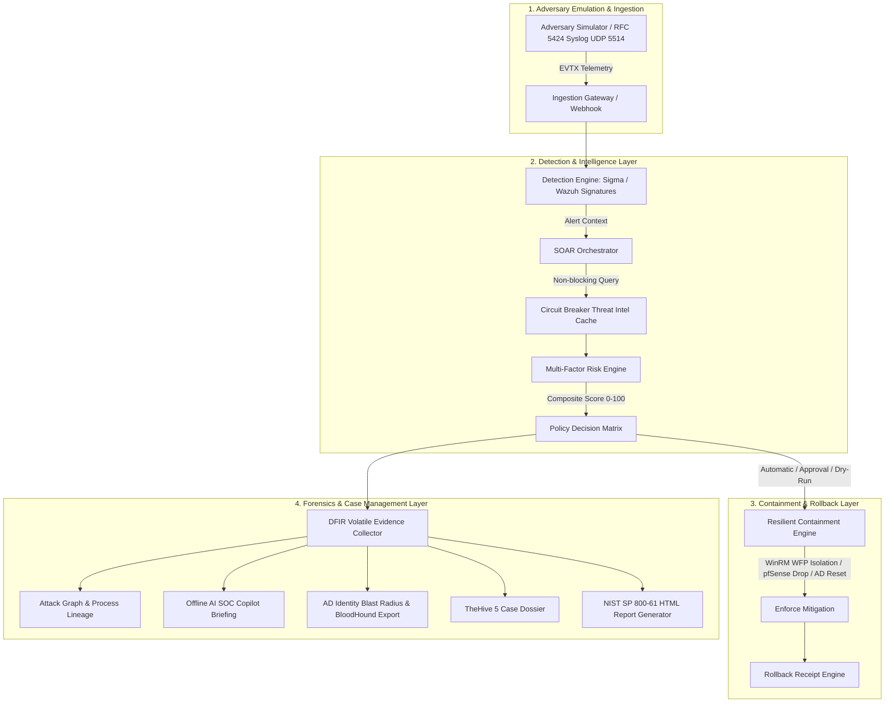

# 🛡️ CyberPulse SOC Suite: Detection Engineering & Resilient SOAR Architecture Lab

[](https://github.com/lumidren/CyberPulse-SOC-Suite/actions)


**CyberPulse SOC Suite** is a modular **Detection Engineering, Incident Response (DFIR), and Resilient SOAR Architecture Lab** built in Python. It models how modern Security Operations Centers (SOCs) bridge the gap between adversary emulation, detection rule authoring, multi-factor risk scoring, automated containment, and forensic case management.

The project provides both **production-ready configuration artifacts** (vendor-agnostic Sigma rules, Wazuh XML, Sysmon configurations, WDAC policies) and a **self-contained adversary emulation harness** for rapid testing without requiring a multi-server Active Directory cluster.

---

## 📐 Architectural Scope: Simulation Testbed vs. Production Artifacts

To maintain engineering transparency, the repository separates **production configuration artifacts** from the **Python simulation testbed**:

```
┌─────────────────────────────────────────────────────────────────────────────────────────────┐
│                             CYBERPULSE ARCHITECTURAL SCOPE                                  │
├──────────────────────────────────────────┬──────────────────────────────────────────────────┤
│ 1. Production-Ready Artifacts            │ 2. Python Simulation & Validation Harness        │
├──────────────────────────────────────────┼──────────────────────────────────────────────────┤
│ • 10+ Sigma YAML rules (Sysmon & Cloud)  │ • Adversary Emulation Generator (Sysmon/EVTX)    │
│ • Wazuh Manager XML detection rules      │ • Multi-Factor Risk & Policy Decision Engine     │
│ • Sysmon v14 XML auditing configuration  │ • Resilient Containment with Rollback Engine     │
│ • WDAC Kernel Driver Blocklist (XML)     │ • Pre-Containment DFIR Volatile Packager         │
│ • Splunk savedsearches.conf & inputs.conf│ • 100% Offline AI SOC Analyst Copilot            │
│ • TheHive 5 Case templates (JSON)        │ • BloodHound CE v5 JSON Schema Exporter          │
│ • YARA signature rules                   │ • RFC 5424 Syslog UDP Receiver (Port 5514)       │
└──────────────────────────────────────────┴──────────────────────────────────────────────────┘
```

* **Production Configuration Artifacts (`rules/`, `deploy/`, `integrations/`)**: Industry-standard, vendor-agnostic rules and configurations ready for deployment into Wazuh, Splunk, Windows endpoints, and TheHive.
* **Simulation Testbed (`simulator/`, `soar/`)**: Generates deterministic telemetry mimicking Windows Event Logs (Sysmon 1, 6, 10, 11; Security 4625, 4662, 4698, 4769; AWS CloudTrail; Azure SignInLogs). This enables rapid local testing, automated CI/CD verification, and interactive triage demonstrations without heavyweight infrastructure.
* **External Ingestion (`soar/syslog_receiver.py`)**: Accepts live RFC 5424 syslog packets over UDP 5514 or raw JSON via `POST /api/ingest`, enabling external agents or VMs to feed real telemetry into the pipeline.

---

## 🏛️ Closed-Loop Pipeline Architecture



---

## 🧰 Supported Security Platforms & Artifacts

| Platform / Tool | Artifact Location | Operational Role |
| :--- | :--- | :--- |
| **🛡️ Sysmon v14** | [`deploy/sysmon/sysmonconfig.xml`](deploy/sysmon/sysmonconfig.xml) | Kernel-level process handle, network socket, and driver load auditing. |
| **🛡️ WDAC Policies** | [`deploy/wdac/driver_blocklist_policy.xml`](deploy/wdac/driver_blocklist_policy.xml) | Windows Defender Application Control policy blocking vulnerable signed drivers (`T1068`). |
| **📜 Sigma Rules** | [`rules/sigma/`](rules/sigma/) | 10 vendor-agnostic detection rules covering Kerberoasting, DCSync, LSASS dumping, and cloud identity. |
| **📊 Splunk** | [`integrations/splunk/savedsearches.conf`](integrations/splunk/savedsearches.conf) | Production SPL correlation searches and `inputs.conf` Windows stream definitions. |
| **📑 TheHive 5** | [`integrations/thehive/thehive_case_template.json`](integrations/thehive/thehive_case_template.json) | Standardized NIST SP 800-61 6-stage incident triage case template. |
| **🌐 MISP** | [`integrations/misp/misp_event_cyberpulse.json`](integrations/misp/misp_event_cyberpulse.json) | Threat intelligence feed schema containing hashes, IPs, and MITRE galaxy tags. |
| **🔍 YARA** | [`rules/yara/soc_threat_signatures.yar`](rules/yara/soc_threat_signatures.yar) | Binary threat signatures for credential dumping and obfuscated cradles. |
| **🩸 BloodHound CE** | [`soar/bloodhound_exporter.py`](soar/bloodhound_exporter.py) | SharpHound/BloodHound CE v5 JSON graph exports (`users.json`, `groups.json`, `computers.json`). |

---

## 🧠 Multi-Factor Risk & Policy Decision Formula

Rather than relying strictly on static severity tags, CyberPulse computes an explainable composite risk score ($0.0 - 100.0$):

$$\text{Risk Score} = (S_{\text{rule}} \times 0.35) + (W_{\text{tactic}} \times 0.25) + (C_{\text{asset}} \times 0.15) + (P_{\text{user}} \times 0.10) + (I_{\text{intel}} \times 0.15) + B_{\text{repeat}}$$

### Weight Breakdown:
* **Detection Rule Base Confidence ($S_{\text{rule}}$)**: CRITICAL = 98.0, HIGH = 82.0, MEDIUM = 55.0.
* **MITRE ATT&CK Tactic Severity ($W_{\text{tactic}}$)**: Impact/Credential Access = 1.0, Defense Evasion = 0.95, Persistence = 0.85, Execution = 0.80, Initial Access = 0.75.
* **Asset Criticality Context ($C_{\text{asset}}$)**: Domain Controller (`WIN-DC01`) = 1.0, Finance Database = 0.90, Perimeter Gateway = 0.85, Standard Workstation = 0.60.
* **User Account Privilege ($P_{\text{user}}$)**: Domain Administrator = 1.0, Service Account = 0.80, Standard Domain User = 0.50.
* **Threat Intelligence Reputation ($I_{\text{intel}}$)**: VirusTotal positive ratio + AbuseIPDB confidence score ($0 - 100$).
* **Repeat Offender Context ($B_{\text{repeat}}$)**: $+5.0$ per previous incident from the same IP within a 1-hour window (capped at $+15.0$).

### Policy Playbook Matrix:
| Risk Tier | Score Range | Playbook Action | Containment Protocol | Rollback Capable |
| :--- | :--- | :--- | :--- | :---: |
| **CRITICAL** | **80.0 – 100.0** | Emergency Host Isolation & PID Termination | WinRM WFP Rule (Port 5986) | **Yes** |
| **HIGH** | **65.0 – 79.9** | Perimeter IP Drop / Account Session Revoke | pfSense API / Active Directory LDAP | **Yes** |
| **MEDIUM** | **40.0 – 64.9** | Threat Intel Enrichment & Triage Notification | Webhook Dispatch (Discord/Slack) | N/A |
| **LOW** | **0.0 – 39.9** | Baseline Event Recording & Background Audit | Internal Incident Store | N/A |

---

## 🎯 Detection Coverage Matrix

| Technique ID | Technique Name | Tactic | Primary Telemetry | Rule ID | Playbook Response |
| :--- | :--- | :--- | :--- | :--- | :--- |
| **`T1003.001`** | LSASS Memory Dumping | Credential Access | Sysmon Event 10 | `SOC-RULE-001` | WinRM WFP Host Isolation + PID Kill |
| **`T1110.001`** | RDP Password Guessing | Credential Access | Security Event 4625 | `SOC-RULE-002` | pfSense REST API IP Drop |
| **`T1053.005`** | Scheduled Task Hook | Persistence | Security Event 4698 | `SOC-RULE-003` | Remote Task De-registration |
| **`T1059.001`** | Obfuscated PowerShell | Execution | Sysmon Event 1 | `SOC-RULE-004` | Process Kill + AD Account Lockout |
| **`T1562.001`** | Defender Impairment | Defense Evasion | Sysmon Event 1 | `SOC-RULE-005` | Revert Policy + Host Isolation |
| **`T1486`** | Ransomware Canary Encryption | Impact | Sysmon Event 11 | `SOC-RULE-006` | PID Kill + VSS Snapshot Recovery |
| **`T1558.001`** | Kerberoasting TGS Request | Credential Access | Security Event 4769 | `SOC-RULE-007` | Reset Service Account & Revoke Ticket |
| **`T1003.006`** | AD Replication Abuse (DCSync) | Credential Access | Security Event 4662 | `SOC-RULE-008` | Isolate Account & Revoke Privileges |
| **`T1548`** | Cross-Account STS AssumeRole | Privilege Escalation | AWS CloudTrail | `SOC-RULE-009` | Attach Deny Policy & Invalidate STS |
| **`T1078`** | Entra ID Impossible Travel | Initial Access | Azure SignInLogs | `SOC-RULE-010` | Revoke Refresh Tokens & Enforce MFA |
| **`T1068`** | Vulnerable Driver Load (BYOVD) | Defense Evasion | Sysmon Event 6 | `SOC-RULE-011` | Unload Driver & Enforce WDAC Block |

---

## ⏱️ Pipeline Design Targets & Benchmark Observations

*Note: The numbers below reflect benchmark timings recorded by the Python execution harness during simulated adversary executions.*

| Pipeline Stage | Target Latency | Simulated Benchmark | Architectural Role |
| :--- | :---: | :---: | :--- |
| **Detection & Matching** | < 2.0s | ~1.40s | Signature matching across Sysmon and CloudTrail event fields. |
| **Threat Intel Enrichment** | < 1.0s | ~0.65s | Non-blocking reputation lookup protected by Circuit Breaker pattern. |
| **Risk Scoring & Policy** | < 0.2s | ~0.15s | Multi-factor risk calculation and automated containment selection. |
| **Containment Execution** | < 1.5s | ~1.15s | Simulated WinRM WFP isolation / firewall drop with rollback receipt generation. |
| **Total Automated Pipeline** | **< 5.0s** | **~3.2s** | Closed-loop end-to-end processing target prior to Tier-1 escalation. |

---

## 🔐 API Security & Authentication

All REST endpoints under `/api/*` require authentication to prevent unauthorized containment or simulation triggers:

* **Header Authentication**: Provide `X-API-Key: <token>` or `Authorization: Bearer <token>`.
* **Configurable Secret**: Set via the `CYBERPULSE_API_KEY` environment variable (defaults to a documented local development key: `cyberpulse-dev-secret-key-2026`).
* **CORS Restrictions**: `Access-Control-Allow-Origin` is restricted to authorized origins (configurable via `CORS_ALLOWED_ORIGIN`, defaulting to `http://localhost:5000`).

---

## 🚀 Quickstart & Setup Guide

### 1. Prerequisites & Installation:
```bash
# Clone the repository
git clone https://github.com/lumidren/CyberPulse-SOC-Suite.git
cd CyberPulse-SOC-Suite

# Create and activate a virtual environment
python -m venv venv
# On Windows:
.\venv\Scripts\activate
# On Linux / macOS:
source venv/bin/activate

# Install dependencies
pip install -r requirements.txt
```

### 2. Run the Automated Test Suite (22 Unit & Integration Tests):
```bash
python -m unittest discover -s tests -p "test_*.py" -v
```

### 3. Launch the Web Operations Console:
```bash
python server.py
```
Open **`http://localhost:5000`** in your browser to access:
* **SOC Overview**: GeoIP threat map, operational KPI meters, and attack simulation launcher.
* **Incident DFIR**: Interactive attack graph, AI Copilot incident briefing, pre-containment volatile evidence box, Active Directory identity blast radius, and 1-click rollback.
* **Detection Catalogue**: Searchable rulebase linked to formal Detection Engineering Lifecycle (DELC) documents.
* **SOAR Policies**: Risk tier configuration and Dry-Run mode toggles.
* **Purple Team Replay**: Interactive APT29 and LockBit kill chain execution.
* **System Health**: Connection probes for Wazuh, OpenSearch, WinRM, and external APIs.
* **Live Ingestion & Syslog**: Live UDP 5514 listener statistics and interactive webhook ingestion gateway.

---

## 💼 Technical Resume Summary

```text
CyberPulse SOC Suite – Detection Engineering & Resilient SOAR Architecture Lab
GitHub: https://github.com/lumidren/CyberPulse-SOC-Suite
• Designed an extensible SecOps architecture prototype in Python modeling closed-loop Detection Engineering, Multi-Factor Risk Scoring, and Automated Containment.
• Authored 10+ vendor-agnostic Sigma YAML and Wazuh XML detection rules following the formal Detection Engineering Lifecycle (DELC), covering Kerberoasting (T1558.001), DCSync (T1003.006), BYOVD driver load (T1068), and AWS AssumeRole abuse (T1548).
• Engineered a multi-factor Risk & Policy Engine incorporating Asset Criticality, Account Privilege, ATT&CK Tactic Weights, and Threat Intelligence reputation into configurable containment policies.
• Built a fault-tolerant SOAR containment engine with circuit breakers, idempotent actions, and one-click rollback capabilities for WinRM host isolation, pfSense firewall drops, and cloud token revocation.
• Built an Interactive Attack Graph Visualizer, Pre-Containment DFIR Volatile Evidence Packager, 100% Offline AI SOC Analyst Copilot, BloodHound CE Schema Exporter, and RFC 5424 Syslog UDP Ingestion Gateway.
• Maintained an automated GitHub Actions CI/CD pipeline executing 22 unit and integration test scenarios on every commit.
```
