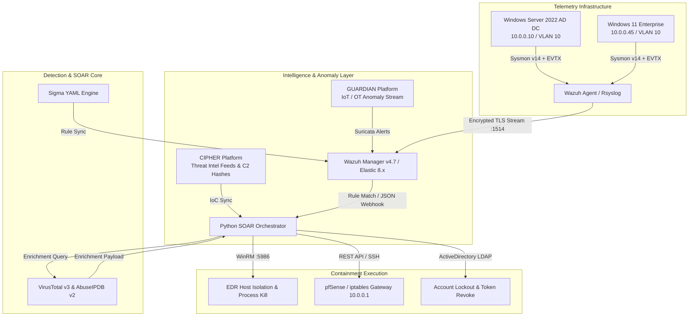

# CyberPulse SOC Suite: Deep Technical Architecture & Specifications

## 1. Executive System Overview
CyberPulse is a modular Detection Engineering and Security Orchestration, Automation, and Response (SOAR) ecosystem designed for hybrid enterprise environments. It ingests low-level kernel telemetry from Windows endpoints via **Sysmon v14**, aggregates events inside a **Wazuh v4.7 SIEM / Elastic** cluster, evaluates vendor-agnostic **Sigma rules**, enriches indicators of compromise (IoCs) via external threat feeds (**VirusTotal v3**, **AbuseIPDB v2**, and local **CIPHER Threat Intel Platform**), and dispatches automated containment commands via **WinRM** and **Firewall REST APIs**.



---

## 2. Network Topology & Lab Specifications

```text
[ WAN / Internet ]
        │
        ▼ (Public WAN Interface)
┌──────────────────────────────────────────────────────────┐
│  Perimeter Firewall Gateway: pfSense 2.7 / iptables     │
│  IP: 10.0.0.1 (Gateway) | API Port: 8443                │
└──────────────────────────────────────────────────────────┘
        │
        ├──────────────────────────────────────────────────┐
        │ [VLAN 10: Enterprise Subnet 10.0.0.0/24]         │ [VLAN 20: SOC Management Subnet 10.0.1.0/24]
        │                                                  │
        ├─▶ Windows Server 2022 DC (10.0.0.10)             ├─▶ Wazuh Manager / OpenSearch (10.0.1.5)
        │   Role: AD DS, DNS, Kerberos                     │   Ports: 1514 (Agent), 55000 (API)
        │   Sensors: Sysmon v14, AuditD                    │
        │                                                  ├─▶ CyberPulse SOAR Engine (10.0.1.10)
        ├─▶ Windows 11 Workstation (10.0.0.45)             │   Ports: 5000 (Web UI / API)
        │   Role: Client Endpoint                          │
        │   Sensors: Sysmon v14, WinRM Enabled             └─▶ CIPHER Threat Intel Platform (10.0.1.20)
        │                                                      IoC Storage & Threat Actor Profiling
        └─▶ Linux Web Server (10.0.0.80)
            Role: Internal ERP / Apache2
```

---

## 3. Telemetry Ingestion & Kernel-Level Sensors

### Sysmon v14 Configuration Standards
Endpoints deploy a hardened Sysmon configuration (based on Olaf Hartong's modular schema) capturing:
- **Event ID 1 (Process Creation)**: Full command-line arguments, parent process IDs, hashes (MD5, SHA256, IMPHASH), and integrity levels.
- **Event ID 10 (ProcessAccess)**: GrantedAccess masks targeting sensitive binaries. Explicitly catches `0x1010` (`PROCESS_VM_READ | PROCESS_QUERY_INFORMATION`) and `0x1400` targeting `lsass.exe`.
- **Event ID 11 (FileCreate)**: Inspects files created in `\Windows\Temp\` and `\AppData\Local\Temp\`.
- **Event ID 13 (RegistryEvent)**: Tracks modifications to Run keys (`HKLM\Software\Microsoft\Windows\CurrentVersion\Run`) and Service ImagePaths.

---

## 4. Closed-Loop SOAR Remediation Mechanics

### 1. Host Isolation Playbook (`PB-ISOLATE-01`)
* **Transport**: Windows Remote Management (WinRM over TLS port 5986).
* **Execution**:
  ```powershell
  # Drops all inbound/outbound IPv4/IPv6 traffic except management port 5986 to SOC Gateway
  New-NetFirewallRule -DisplayName "SOC-Emergency-Isolation" -Direction Outbound -Action Block -Priority 1
  New-NetFirewallRule -DisplayName "SOC-Management-Allow" -Direction Inbound -Action Allow -RemoteAddress "10.0.1.10" -LocalPort 5986 -Protocol TCP -Priority 2
  ```

### 2. Perimeter Gateway Block Playbook (`PB-FIREWALL-BLOCK-02`)
* **Transport**: pfSense REST API or Linux `iptables` over SSH.
* **Execution**:
  ```bash
  iptables -I INPUT 1 -s <Attacker_IP>/32 -p tcp --dport 3389 -j DROP -m comment --comment "CyberPulse-Auto-Block"
  ```

### 3. Active Directory Containment (`PB-AD-LOCKDOWN-03`)
* **Transport**: Microsoft ADSI / LDAP.
* **Execution**:
  ```powershell
  Set-ADUser -Identity "<compromised_user>" -Enabled $false -ChangePasswordAtLogon $true
  Revoke-AzureADUserAllRefreshToken -ObjectId "<user_guid>"
  ```

---

## 5. Ecosystem Alignment: CIPHER + CyberPulse + GUARDIAN

| Platform | Domain | Primary Function in Portfolio |
| :--- | :--- | :--- |
| **CIPHER** | Threat Intelligence | Ingests OSINT/ISAC feeds, scores threat actors, extracts high-confidence IoCs. |
| **CyberPulse** | Detection & SOAR *(This Lab)* | Correlates real-time endpoint telemetry against Sigma rules, queries CIPHER for IoC reputation, and triggers automated WinRM/firewall containment. |
| **GUARDIAN** | Network & IoT Security | Monitors edge network flows, detects anomalies in IoT/OT telemetry, and forwards high-risk alerts to CyberPulse. |
