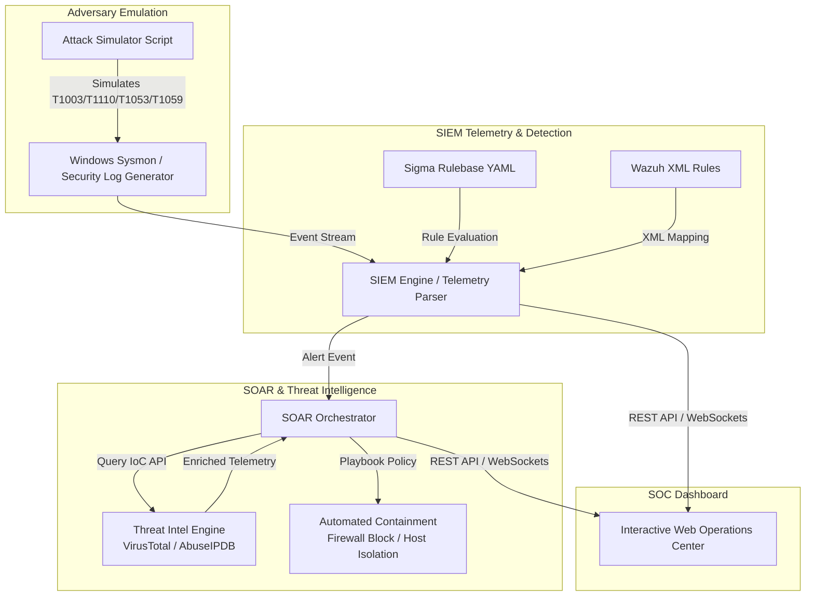

# AegisSOC Laboratory Architectural Specification

## Overview
AegisSOC is a self-contained, enterprise-grade Security Operations Center (SOC) lab environment designed to emulate real-world adversary tactics, collect endpoint telemetry, evaluate detection rules against the MITRE ATT&CK framework, automate threat intelligence enrichment, and trigger automated containment workflows.

---

## 1. Adversary Emulation Component (`simulator/attack_simulator.py`)

The simulator generates telemetry for four core adversary techniques:
- **T1003.001 (LSASS Memory Read)**: Emulates process access requests targeting `lsass.exe` with access rights `0x1010` (PROCESS_VM_READ | PROCESS_QUERY_INFORMATION).
- **T1110.001 (Password Brute Force)**: Emulates high-frequency Windows Security Audit Failure events (EventID 4625) over RDP (LogonType 10).
- **T1053.005 (Scheduled Task Persistence)**: Emulates Windows EventID 4698 logging new scheduled tasks containing obfuscated PowerShell download cradles.
- **T1059.001 (Encoded PowerShell Execution)**: Emulates Sysmon EventID 1 process creation events executing `-EncodedCommand` flags.

---

## 2. Detection Engine & Rulebase (`rules/`)

Detection logic is written in vendor-agnostic **Sigma YAML** and translated into **Wazuh XML**:
- **Rule `win_lsass_dumping.yml`**: Triggers on Sysmon Event 10 targeting `lsass.exe` excluding trusted binaries (`svchost.exe`, `csrss.exe`, `MsMpEng.exe`).
- **Rule `win_brute_force_auth.yml`**: Triggers when >10 failed logon attempts originate from a single IP within 5 minutes.
- **Rule `win_scheduled_task_persistence.yml`**: Triggers when scheduled task definitions contain keywords `powershell`, `cmd.exe`, `http:`, or `https:`.

---

## 3. SOAR Engine & Threat Intelligence (`soar/soar_engine.py`)

When a detection rule matches:
1. **Extraction**: The orchestrator extracts IoCs (Source IP, File Hash, Process PID, User Account).
2. **Enrichment**: IoCs are queried against VirusTotal (file reputation, vendor detection count) and AbuseIPDB (IP abuse confidence score, ISP, Geo-location).
3. **Automated Containment**: Based on severity:
   - `CRITICAL` -> Calls EDR API to isolate target host and terminate PID.
   - `HIGH (Brute Force)` -> Pushes perimeter gateway firewall rule blocking source IP.
   - `HIGH (Persistence)` -> Executes remote PowerShell command to purge malicious task.

---

## 4. Web Operations Center (`web/` & `server.py`)

Built with pure Vanilla HTML5, CSS3 (Glassmorphism / Cyberpunk Theme), and JavaScript:
- **Real-Time Alert Ticker**: Dynamic rendering of incoming SIEM alerts.
- **MITRE Heatmap**: Visual coverage grid showing hit frequency per technique.
- **Intel Drawer**: Deep-dive threat context for selected alerts.
- **Terminal Audit Trail**: Streaming output of SOAR playbook execution steps.
