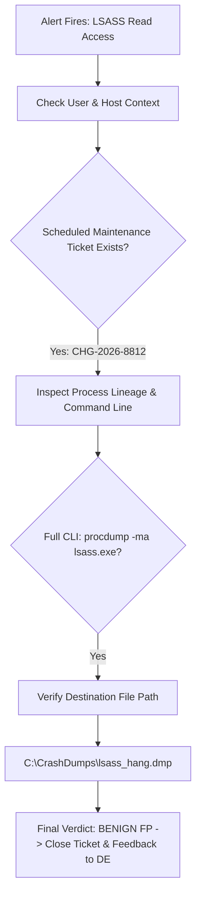

# SOC Tier-1 / Tier-2 Triage Case Study 01: LSASS Access False Positive Analysis

| Incident ID | Fired Rule | Initial Severity | Final Triage Verdict | Assigned Analyst |
| :--- | :--- | :--- | :--- | :--- |
| **TRIAGE-2026-0821-01** | `SOC-RULE-001` (LSASS Access) | **CRITICAL** | **BENIGN FALSE POSITIVE (Authorized Sysadmin)** | Tier-1 Analyst (lumidren) |

---

## 1. Alert Trigger & Initial Triage
At **02:14:22 UTC**, the SIEM generated a CRITICAL alert indicating `procdump.exe` opened a handle to `lsass.exe` with access rights `0x1010` on server `CORP-APP-PROD01`.

### Raw Alert Summary:
* **Host**: `CORP-APP-PROD01` (10.0.0.80)
* **Source Image**: `C:\Tools\Sysinternals\procdump64.exe`
* **Target Image**: `C:\Windows\System32\lsass.exe`
* **User Account**: `CORP\svc_backup_admin`

---

## 2. Analyst Investigative Workflow & Hypothesis Testing

### Step 1: Context & Change Management Verification
* **Action**: Analyst cross-referenced ServiceNow Change Management tickets for `CORP-APP-PROD01`.
* **Finding**: Change Request **`CHG-2026-8812`** was approved for Senior Systems Engineer `m.keller` between 02:00 and 04:00 UTC to troubleshoot intermittent LSASS memory leak hangs affecting Active Directory authentication.

### Step 2: Process Lineage & Command Line Inspection
* **Parent Image**: `C:\Windows\System32\cmd.exe` (Parent PID: 3412)
* **Grandparent Image**: `C:\Windows\System32\explorer.exe` (User session established via Console RDP from authorized jumpbox `10.0.1.25`).
* **Full Command Line**: `C:\Tools\Sysinternals\procdump64.exe -ma lsass.exe C:\CrashDumps\lsass_hang.dmp`
* **Destination File**: Stored inside restricted directory `C:\CrashDumps\` (ACL restricted to `NT AUTHORITY\SYSTEM` and `Domain Admins`).

### Step 3: Network Indicator & C2 Verification
* **Network Sockets**: Process `procdump64.exe` established **zero outbound TCP/UDP network connections**.
* **File Hashes**: SHA256 matches official Microsoft Sysinternals signed binary.

---

## 3. Triage Verdict & Feedback Loop

### Disposition:
* **Verdict**: **BENIGN FALSE POSITIVE**. Authorized sysadmin crash diagnostic during scheduled maintenance.

### Detection Engineering Feedback:
* The alert correctly identified user-mode LSASS memory scraping, but highlighted a need for:
  1. Temporary maintenance window suppression rules in Wazuh for approved Change Request hosts.
  2. Rule refinement: Alert with HIGH severity rather than immediate automated isolation when the source binary is signed by Microsoft Sysinternals and running under interactive Console sessions.
